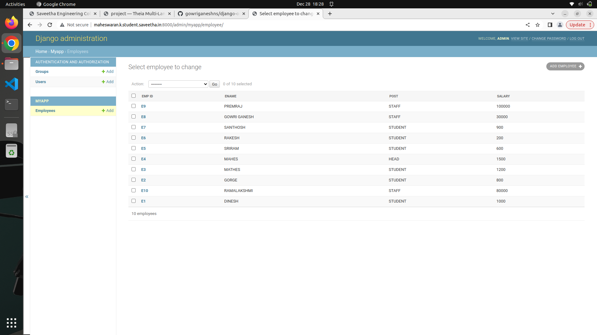
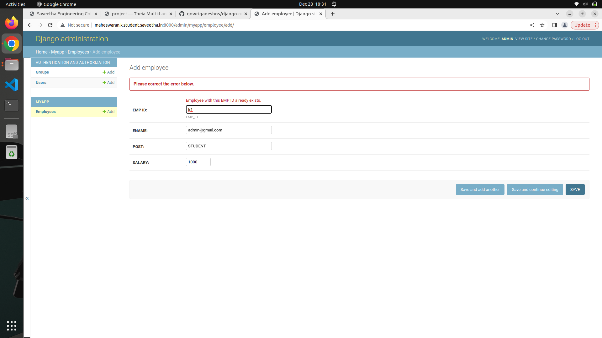

# Django ORM Web Application

## AIM
To develop a Django application to store and retrieve data from a database using Object Relational Mapping(ORM).

## Entity Relationship Diagram

Include your ER diagram here

## DESIGN STEPS

### STEP 1:

Then clone it. Create myapp

### STEP 2:

Then run the webserver,create the super user,after that create the 10 employee id

### STEP 3:

Then add the screenshot of employee id in output

Write your own steps

## PROGRAM

Include your code here

## OUTPUT

### Employee Id Details:

### Primary Key Error:

## RESULT
